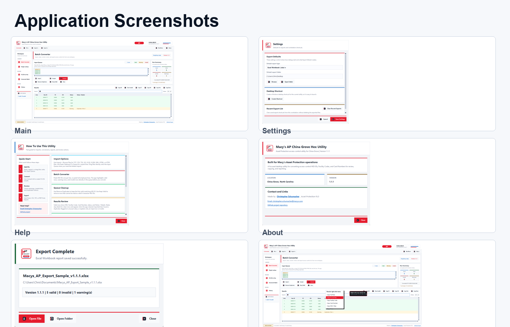
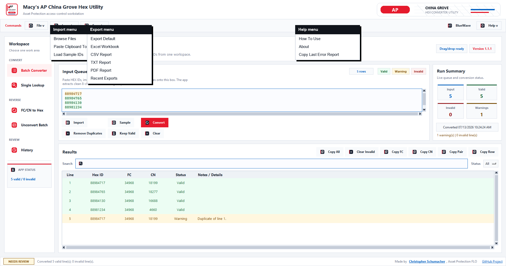
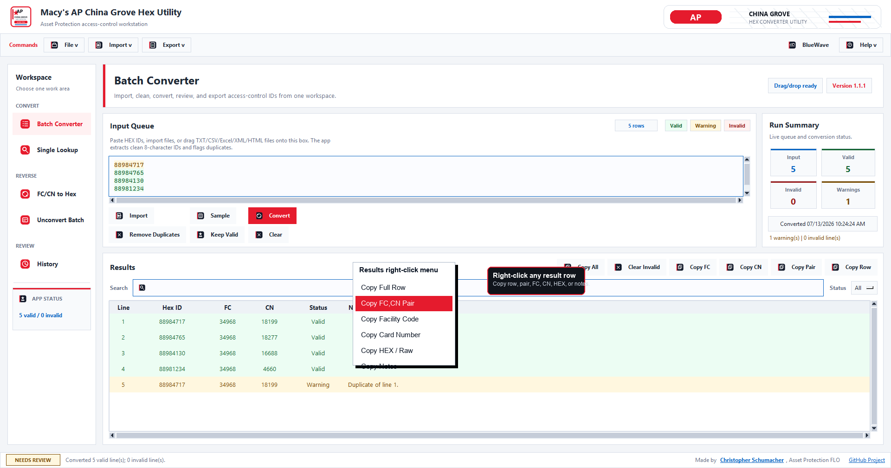
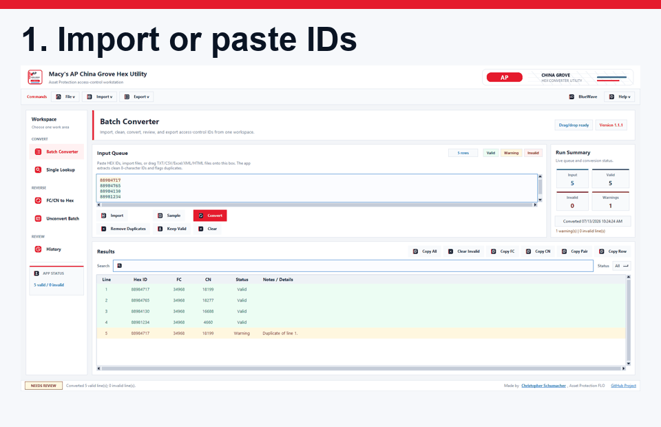

# Macy's Asset Protection China Grove Hex Converter Utility


[](https://github.com/rice2k/Macys-Asset-Protection-HEX-Converter-Tool/raw/main/dist/Macys_AP_China_Grove_Hex_Utility.exe)
[](docs/README.md)
[](docs/source-history/README.md)

Windows desktop utility for Macy's Asset Protection access-control conversion work at China Grove, North Carolina.

The utility converts access-control HEX values into Facility Code and Card Number, reverses FC/CN pairs back into HEX, cleans imported data, and exports professional reports for review.

## Start Here

| Need | Best Link |
| --- | --- |
| Download the current test app | [Macys_AP_China_Grove_Hex_Utility.exe](https://github.com/rice2k/Macys-Asset-Protection-HEX-Converter-Tool/raw/main/dist/Macys_AP_China_Grove_Hex_Utility.exe) |
| Learn how to use it | [User Guide](docs/notes/user-guide.md) |
| See every menu, button, tab, and right-click option | [Every Option Reference](docs/notes/every-option-reference.md) |
| Check examples and import cleanup | [Input Examples](docs/notes/input-examples.md) |
| Verify the download | [Downloads And Releases](docs/notes/downloads-and-releases.md) |
| View all screenshots | [Screenshot Guide](docs/screenshots/README.md) |
| Restore an older version | [Restore Older Versions](docs/notes/restore-older-versions.md) |

## Quick Links

| Need | Link |
| --- | --- |
| GitHub project page | [Repository home](https://github.com/rice2k/Macys-Asset-Protection-HEX-Converter-Tool) |
| Download latest test EXE | [Macys_AP_China_Grove_Hex_Utility.exe](https://github.com/rice2k/Macys-Asset-Protection-HEX-Converter-Tool/raw/main/dist/Macys_AP_China_Grove_Hex_Utility.exe) |
| Verify download checksum | [SHA-256 checksum](https://raw.githubusercontent.com/rice2k/Macys-Asset-Protection-HEX-Converter-Tool/main/dist/Macys_AP_China_Grove_Hex_Utility.exe.sha256.txt) |
| Full documentation hub | [docs/README.md](docs/README.md) |
| User guide | [docs/notes/user-guide.md](docs/notes/user-guide.md) |
| Feature reference | [docs/notes/feature-reference.md](docs/notes/feature-reference.md) |
| Every option reference | [docs/notes/every-option-reference.md](docs/notes/every-option-reference.md) |
| Keyboard shortcuts | [docs/notes/keyboard-shortcuts.md](docs/notes/keyboard-shortcuts.md) |
| Version history | [docs/notes/version-history.md](docs/notes/version-history.md) |
| Roadmap and known issues | [docs/notes/roadmap-and-known-issues.md](docs/notes/roadmap-and-known-issues.md) |
| Original HTML/source archive | [docs/source-history/README.md](docs/source-history/README.md) |
| Git tags | [Version tags](https://github.com/rice2k/Macys-Asset-Protection-HEX-Converter-Tool/tags) |
| GitHub Releases area | [Releases](https://github.com/rice2k/Macys-Asset-Protection-HEX-Converter-Tool/releases) |

## Current Test Build

Current version: `1.1.2`

Current SHA-256:

`24084805a9db05273f50b8e594bf39cefbb9c0c878ba0e72426afd626025ad4a`

Windows may show a SmartScreen warning because the EXE is not code-signed yet. For testing, choose **More info**, then **Run anyway**.

## Who This Is For

This app is for Asset Protection and access-control review work where a user needs to quickly convert, clean, copy, compare, or export HEX badge/card values.

It is designed for the China Grove workflow, but the conversion rule is documented clearly so the project can be reviewed and tested from GitHub.

## What It Solves

Access-control data often comes from copied spreadsheet columns, exported tables, plain text, or mixed employee lines. This utility gives one focused place to:

- Extract usable 8-character IDs from messy input.
- Use keyboard-style handheld scanners for Batch Converter and Single Lookup.
- Convert HEX values to Facility Code and Card Number.
- Convert FC/CN pairs back to HEX.
- Flag invalid, duplicate, cleaned, or unusual rows.
- Export readable reports for review.

## 60-Second Workflow

1. Download and open the test EXE.
2. Scan IDs, paste IDs, import files, or drag supported files into the Input Queue.
3. Review green, yellow, and red row highlights.
4. Use Convert.
5. Copy rows, FC/CN pairs, or individual values from Results.
6. Export Excel, CSV, TXT, or PDF when a report is needed.

## Project Tags

`access-control` `asset-protection` `hex-converter` `facility-code` `card-number` `windows-desktop` `python` `tkinter` `excel-import` `report-export` `macy-style-ui` `china-grove`

## Conversion Rule

Facility Code (FC) is taken from the high 16 bits. Card Number (CN) is taken from the low 16 bits of the 32-bit HEX value.

Example:

| HEX | Facility Code | Card Number |
| --- | ---: | ---: |
| `88984717` | `34968` | `18199` |

## Main Features

- Batch converts many 8-character HEX IDs into Facility Code and Card Number.
- Batch Scanner Input places each new handheld scan at the top of the Input Queue and tracks the scan count for the session.
- F9 focuses Batch Scanner Input, and F10 focuses Single Lookup.
- Single Lookup can auto-convert one scanned HEX ID and copy the FC,CN pair.
- Converts one FC/CN pair or a batch of FC/CN pairs back into HEX.
- Imports TXT, CSV, TSV, XLS, XLSX, XLSM, XML Spreadsheet, HTML, and copied table data.
- Cleans Excel-style numeric IDs such as `88984765.0` and split IDs such as `8898-4765`.
- Previews cleaned numeric IDs before adding messy clipboard data to the queue.
- Highlights valid, warning, and invalid input rows.
- Shows Notes / Details only when a row was cleaned, duplicated, unusual, or invalid.
- Removes duplicates and keeps only valid rows during queue cleanup.
- Supports full-row copying, FC/CN copying, HEX copying, and right-click result actions.
- Makes the sidebar status card and bottom status strip clickable for quick navigation back to the related workspace.
- Exports Excel, CSV, TXT, and PDF reports.
- Includes Help, About, Settings, History, Recent Exports, desktop shortcut support, and copyable error reports.

## Import And Export Support

| Import Type | Supported |
| --- | --- |
| Plain text | TXT |
| Spreadsheet/table text | CSV, TSV |
| Excel workbooks | XLS, XLSX, XLSM |
| Web/table exports | HTML, HTM |
| XML spreadsheet exports | XML Spreadsheet |
| Clipboard data | Copied lines, copied spreadsheet rows, copied table data |

| Export Type | Best Use |
| --- | --- |
| Excel Workbook | Most polished review report with sheets, colors, filters, and wrapped notes. |
| CSV Report | Simple spreadsheet-compatible data transfer. |
| TXT Report | Plain text review or quick sharing. |
| PDF Report | Readable formatted report for review. |

## Validation Colors

| Color | Meaning |
| --- | --- |
| Green | Valid row. |
| Yellow | Valid row with a warning, cleanup note, duplicate, or unusual value. |
| Red | Invalid row that needs review. |

Notes / Details stays blank for clean rows. It appears only when the app cleaned a value, found a duplicate, flagged unusual input, or explains why a row is invalid.

## Screenshots



| Screen | Preview |
| --- | --- |
| Main workspace |  |
| Menu options |  |
| Right-click results menu |  |
| Settings |  |
| Help |  |
| About |  |
| Export complete |  |

## Demo



## Current Limitations

- The EXE is not code-signed yet, so Windows may show a SmartScreen warning.
- Automated GitHub release builds are not currently running, so the test EXE is linked directly from the repository.
- Drag/drop depends on optional Windows/Tkinter drag/drop support; Import > Browse Files is the fallback.
- The app is a local utility and does not replace the official system of record.

## Roadmap

See [Roadmap And Known Issues](docs/notes/roadmap-and-known-issues.md) for the living improvement list.

Current recommended next improvements:

- Create manual GitHub Releases for stable EXE downloads.
- Add code signing when a trusted certificate is available.
- Add a short video or polished GIF walkthrough for each workflow.
- Add more sample import files for testing.
- Add optional packaged sample reports.

## Known Issues

No app-breaking issues are currently documented for version `1.1.2`.

See [Troubleshooting](docs/notes/troubleshooting.md) for common testing notes.

## Source History

The original Access Control script document and earlier browser-based HTML versions are preserved so the project history is visible on GitHub:

[View original source history and HTML archive](docs/source-history/README.md)

The archived HTML versions are reference material only. The maintained app is the current Windows desktop EXE and `desktop_app.py`.

## Version Tags And Restore Points

| Version | Tag | Notes |
| --- | --- | --- |
| `1.1.2` | [`v1.1.2`](https://github.com/rice2k/Macys-Asset-Protection-HEX-Converter-Tool/tree/v1.1.2) | Current bugfix build; corrected status strip review logic, warning-count messages, and scanner state hardening. |
| `1.1.1` | [`v1.1.1`](https://github.com/rice2k/Macys-Asset-Protection-HEX-Converter-Tool/tree/v1.1.1) | Scanner input, clickable status navigation, polished Help/About, cleaner imports, and improved Results alignment. |
| `1.1.0` | [`v1.1.0`](https://github.com/rice2k/Macys-Asset-Protection-HEX-Converter-Tool/tree/v1.1.0) | Workflow polish, paste cleanup preview, right-click copy menus, recent export cleanup. |
| `1.0.9` | [`v1.0.9`](https://github.com/rice2k/Macys-Asset-Protection-HEX-Converter-Tool/tree/v1.0.9) | Almost-done baseline before v1.1.x workflow/documentation polish. |

More detail: [docs/notes/version-history.md](docs/notes/version-history.md)

Restore guide: [docs/notes/restore-older-versions.md](docs/notes/restore-older-versions.md)

## Run From Source

```powershell
python desktop_app.py
```

## Test

```powershell
python -m py_compile desktop_app.py tests\desktop_app_smoke.py
python tests\desktop_app_smoke.py
python desktop_app.py --self-test
```

## Build Windows EXE

```powershell
python -m PyInstaller --noconfirm --clean Macys_AP_China_Grove_Hex_Utility.spec
```

Expected output:

`dist/Macys_AP_China_Grove_Hex_Utility.exe`

## Credit

Made by Christopher Schumacher, Asset Protection FLO.

GitHub profile: [rice2k](https://github.com/rice2k)

## Release Notes

Releases use the built Windows EXE and SHA-256 checksum file from `dist`.

Before tagging a future version, add a matching `RELEASE_NOTES_vX.Y.Z.md` file so the GitHub Release has clean notes and restore details.

Automated GitHub release builds are not currently running, so the test EXE is linked directly from the repository for easy download and testing.

Release checklist: [docs/notes/release-checklist.md](docs/notes/release-checklist.md)

See [CHANGELOG.md](CHANGELOG.md) for version history.
