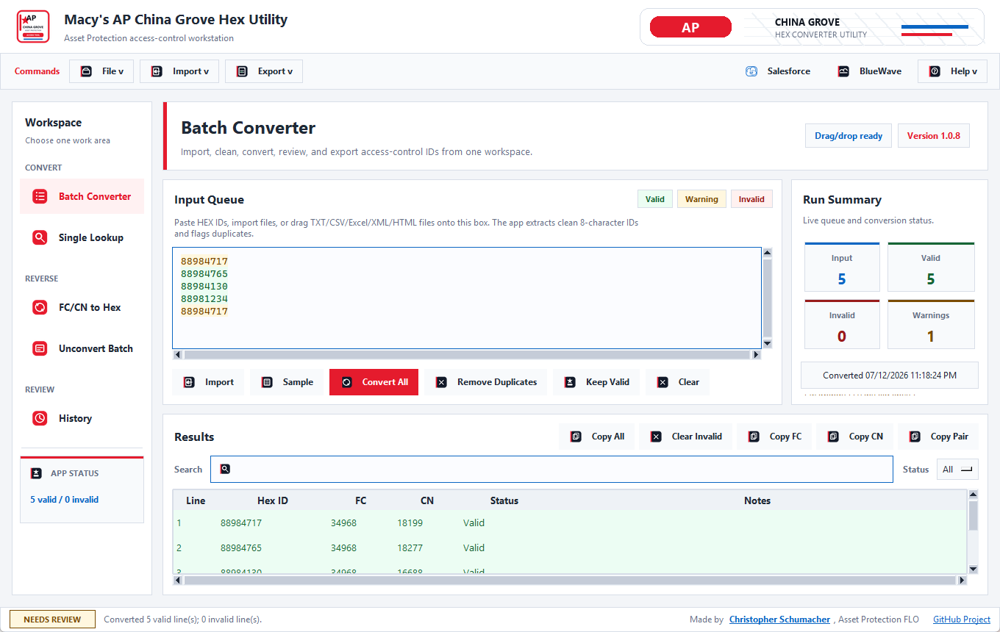
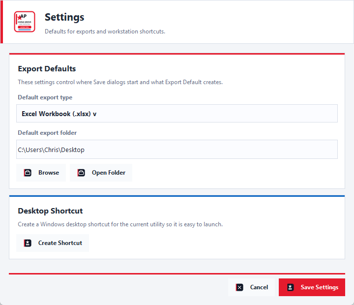
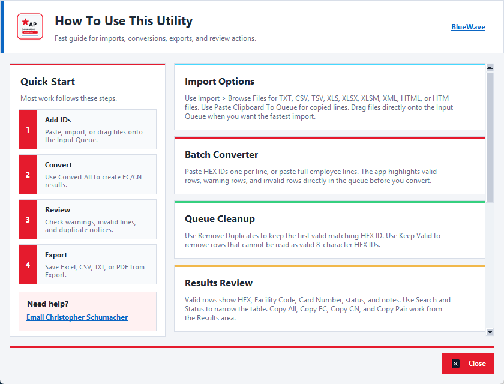
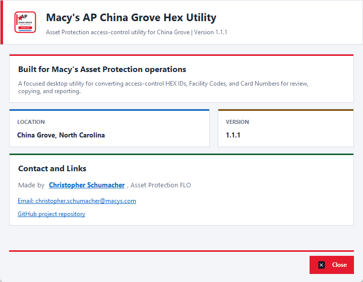
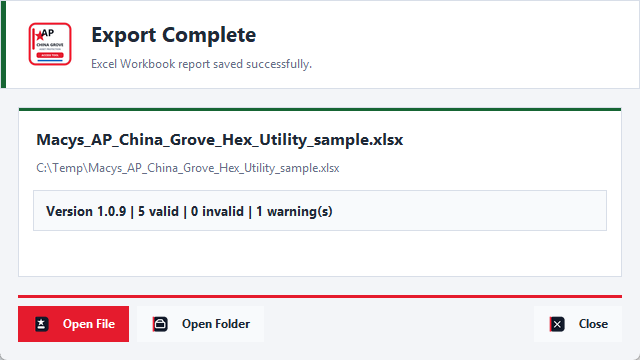

# Macy's Asset Protection China Grove Hex Converter Utility

Current version: `1.1.0`

Windows desktop utility for Macy's Asset Protection access-control conversion work at China Grove, North Carolina.

## What It Does

- Converts one or many 8-character HEX IDs into Facility Code and Card Number.
- Converts FC/CN pairs back into HEX IDs.
- Imports TXT, CSV, TSV, XLS, XLSX, XLSM, XML Spreadsheet, HTML, and copied table data.
- Cleans Excel-style numeric IDs such as `88984765.0` and split IDs such as `8898-4765`.
- Highlights valid, warning, and invalid input rows.
- Shows a live row count while editing the input queue.
- Previews cleaned numeric IDs before pasting messy Excel-style clipboard data.
- Removes duplicates and keeps only valid rows when cleaning a queue.
- Supports full-row copying and right-click copy actions in result tables.
- Exports professional Excel, CSV, TXT, and PDF reports.
- Includes Help, About, Settings, History, recent exports, clearable recent export history, default export settings, copyable error reports, and desktop shortcut support.

## Screenshots











## Run From Source

```powershell
python desktop_app.py
```

## Test

```powershell
python -m py_compile desktop_app.py tests\desktop_app_smoke.py
python tests\desktop_app_smoke.py
python desktop_app.py --self-test
```

## Build Windows EXE

```powershell
python -m PyInstaller --noconfirm --clean Macys_AP_China_Grove_Hex_Utility.spec
```

The current built executable is:

`dist/Macys_AP_China_Grove_Hex_Utility.exe`

## Credit

Made by Christopher Schumacher, Asset Protection FLO.

GitHub project: https://github.com/rice2k/Macys-Asset-Protection-HEX-Converter-Tool

## Release Notes

Releases use the built Windows EXE and SHA-256 checksum file from `dist`.
Before tagging a future version, add a matching `RELEASE_NOTES_vX.Y.Z.md` file so the GitHub Release has clean notes and restore details.

See `CHANGELOG.md` for version history.
