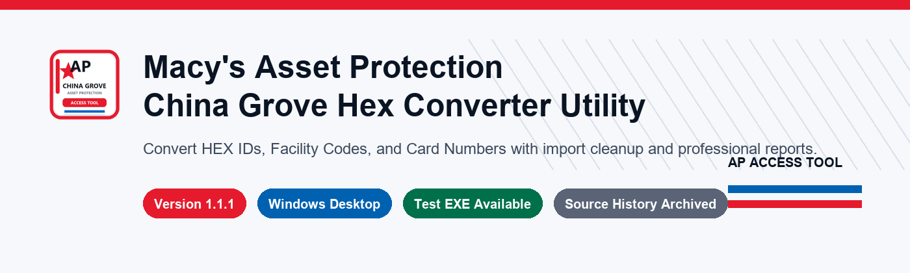

# Documentation Hub

This folder contains the detailed notes for the Macy's Asset Protection China Grove Hex Converter Utility.

## Start Here

| Page | Purpose |
| --- | --- |
| [User Guide](notes/user-guide.md) | How to use the current Windows desktop app. |
| [Feature Reference](notes/feature-reference.md) | Detailed list of app features and what each area does. |
| [Every Option Reference](notes/every-option-reference.md) | Every tab, toolbar item, dropdown item, button, status area, and right-click option. |
| [Input Examples](notes/input-examples.md) | Good input, bad input, warnings, cleanup examples, and FC/CN examples. |
| [Excel And Clipboard Tips](notes/excel-clipboard-tips.md) | How copied Excel/table data is cleaned and imported. |
| [Keyboard Shortcuts](notes/keyboard-shortcuts.md) | Shortcut keys, mouse actions, and copy actions. |
| [Version History](notes/version-history.md) | Current version, previous versions, restore tags, and archive branches. |
| [Restore Older Versions](notes/restore-older-versions.md) | How to inspect or recover old states with tags and archive branches. |
| [Downloads And Releases](notes/downloads-and-releases.md) | Test EXE download links, checksum, release notes, and automation status. |
| [Release Checklist](notes/release-checklist.md) | Steps to package, tag, verify, and publish future releases. |
| [Roadmap And Known Issues](notes/roadmap-and-known-issues.md) | Planned improvements, known limitations, and future polish ideas. |
| [Troubleshooting](notes/troubleshooting.md) | Common import, export, SmartScreen, and validation issues. |
| [Screenshot Guide](screenshots/README.md) | Labeled screenshots for the current app and menus. |
| [Image Assets](images/README.md) | GitHub banner, icon, collage, and demo GIF used by the project page. |
| [Source History](source-history/README.md) | Original source document and earlier HTML versions. |

## Project URLs

| Resource | URL |
| --- | --- |
| Repository | <https://github.com/rice2k/Macys-Asset-Protection-HEX-Converter-Tool> |
| Direct EXE download | <https://github.com/rice2k/Macys-Asset-Protection-HEX-Converter-Tool/raw/main/dist/Macys_AP_China_Grove_Hex_Utility.exe> |
| Checksum file | <https://raw.githubusercontent.com/rice2k/Macys-Asset-Protection-HEX-Converter-Tool/main/dist/Macys_AP_China_Grove_Hex_Utility.exe.sha256.txt> |
| Tags | <https://github.com/rice2k/Macys-Asset-Protection-HEX-Converter-Tool/tags> |
| Releases area | <https://github.com/rice2k/Macys-Asset-Protection-HEX-Converter-Tool/releases> |
| Source history | <https://github.com/rice2k/Macys-Asset-Protection-HEX-Converter-Tool/tree/main/docs/source-history> |
| Screenshots | <https://github.com/rice2k/Macys-Asset-Protection-HEX-Converter-Tool/tree/main/docs/screenshots> |

## Current Version

Current app version: `1.1.2`

Current EXE:

[Download Macys_AP_China_Grove_Hex_Utility.exe](https://github.com/rice2k/Macys-Asset-Protection-HEX-Converter-Tool/raw/main/dist/Macys_AP_China_Grove_Hex_Utility.exe)

Current SHA-256:

`24084805a9db05273f50b8e594bf39cefbb9c0c878ba0e72426afd626025ad4a`

## Project Structure

| Path | What It Contains |
| --- | --- |
| `desktop_app.py` | Current maintained Python/Tkinter desktop application. |
| `dist/` | Current built Windows EXE and checksum file. |
| `src/assets/` | App icon and custom visual assets. |
| `tests/` | Smoke checks for conversion, import cleanup, and app behavior. |
| `docs/screenshots/` | GitHub README screenshots. |
| `docs/images/` | README banner, icon, collage, and demo GIF. |
| `docs/source-history/` | Original script document and earlier HTML versions. |
| `docs/notes/` | Detailed GitHub documentation pages. |
| `RELEASE_NOTES_v*.md` | Release notes for version tags. |

## Conversion Rule

Facility Code (FC) is taken from the high 16 bits. Card Number (CN) is taken from the low 16 bits of the 32-bit HEX value.

## Documentation Notes

- The current maintained program is the Windows desktop app.
- The HTML files in `source-history` are historical reference versions.
- The direct EXE link is available even while automated release builds are not running.
- GitHub version tags and archive branches are kept so older project states can be recovered.
