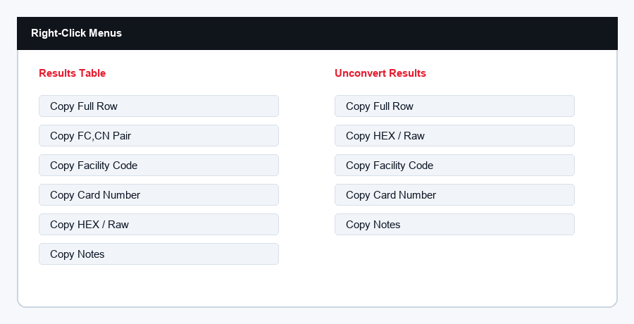

# Every Option Reference

This page documents the visible options in version `1.1.6`.

## Top Toolbar

| Option | Action |
| --- | --- |
| File | Opens file/workstation options. |
| Import | Opens import options. |
| Export | Opens export/report options. |
| BlueWave | Opens the configured access-control site in the default browser. |
| Help | Opens help/about/error-report options. |

## File Menu

| Option | Action |
| --- | --- |
| Settings | Opens default export settings, shortcut tools, and recent export cleanup. |
| Choose Default Export Folder | Sets the folder where export dialogs should start. |
| Open Export Folder | Opens the current default export folder. |
| Create Desktop Shortcut | Creates a Windows desktop shortcut for the utility. |
| Exit | Closes the app. |

## Import Menu

| Option | Action |
| --- | --- |
| Browse Files | Imports supported files from the computer. |
| Paste Clipboard To Queue | Reads copied text/table data and offers cleanup when needed. |
| Load Sample IDs | Loads numeric sample IDs into the Input Queue. |
| Focus Batch Scanner (F9) | Opens Batch Converter and focuses Scanner Input. |
| Focus Single Lookup (F10) | Opens Single Lookup and focuses the HEX ID input. |

## Export Menu

| Option | Action |
| --- | --- |
| Export Default | Exports using the saved default report type from Settings. |
| Excel Workbook | Creates a formatted `.xlsx` workbook. |
| CSV Report | Creates a `.csv` report. |
| TXT Report | Creates a plain text `.txt` report. |
| PDF Report | Creates a formatted `.pdf` report. |
| Recent Exports | Opens the recent export list for reopening saved reports. |

## Help Menu

| Option | Action |
| --- | --- |
| How To Use | Opens the visual help guide. |
| About | Opens app purpose, version, contact, and project links. |
| Copy Last Error Report | Copies the most recent import/export error details for troubleshooting. |

## Workspace Tabs

| Tab | Purpose |
| --- | --- |
| Batch Converter | Main workflow for converting many HEX IDs to Facility Code and Card Number. |
| Single Lookup | Converts one HEX ID and copies the FC,CN pair. |
| FC/CN To Hex | Converts one Facility Code/Card Number pair back to HEX. |
| Unconvert Batch | Converts many FC/CN pairs back to HEX IDs. |
| History | Shows recent local conversion activity. |

## Batch Converter Buttons

| Option | Action |
| --- | --- |
| Scanner Input | Accepts keyboard-style handheld scanner input. New scans are cleaned, counted, and placed at the top of the Input Queue. F9 focuses this field. |
| Input Queue | Accepts scanned, pasted, imported, or dragged-in HEX ID rows. |

| Button | Action |
| --- | --- |
| Import | Browse for one or more supported files and add extracted IDs to the queue. |
| Sample | Loads numeric sample IDs. |
| Convert | Converts every queued HEX ID into FC/CN results. |
| Remove Duplicates | Keeps the first matching valid HEX ID and removes later repeated values. |
| Keep Valid | Removes rows that cannot be read as valid 8-character HEX IDs. |
| Clear | Clears input, results, and single lookup fields. |

## Results Tools

| Option | Action |
| --- | --- |
| Search | Filters visible results by typed text. |
| Status | Filters results by All, Valid, Warning, or Invalid. |
| Copy All | Copies all valid FC,CN pairs. |
| Clear Invalid | Removes invalid rows from the review table. |

## Results Right-Click Menu

| Option | Action |
| --- | --- |
| Copy Full Row | Copies line, HEX/raw, FC, CN, status, and notes. |
| Copy FC,CN Pair | Copies the selected row as `FC,CN`. |
| Copy Facility Code | Copies only FC. |
| Copy Card Number | Copies only CN. |
| Copy HEX / Raw | Copies the cleaned HEX value or raw invalid input. |
| Copy Notes | Copies the Notes / Details text. |

## Single Lookup

| Option | Action |
| --- | --- |
| HEX ID input | Accepts one 8-character HEX value. |
| Scanner input behavior | A keyboard-style scanner can submit with Enter or Tab and the app will auto-convert the scan. F10 focuses this field. |
| Convert | Converts the value and copies the FC,CN pair. |
| Clear | Clears the field and result. |
| Focus Scanner | Returns the cursor to the Single Lookup scanner/input field. |
| Click result numbers | Copies the clicked HEX ID, Facility Code, or Card Number value. |

## FC/CN To Hex

| Option | Action |
| --- | --- |
| Facility Code input | Accepts a whole number from 0 to 65535. |
| Card Number input | Accepts a whole number from 0 to 65535. |
| Convert | Builds one 8-character HEX value. |
| Clear | Clears the fields and result. |
| Click HEX output | Copies the generated HEX ID value. |

## Unconvert Batch

| Option | Action |
| --- | --- |
| Input box | Accepts one FC/CN pair per line. |
| Sample | Loads numeric FC/CN sample pairs. |
| Unconvert | Converts every queued pair back into HEX. |
| Copy All HEX | Copies all valid unconverted HEX values. |
| Clear | Clears unconvert input and results. |
| Copy Selected HEX | Copies the selected valid HEX result. |

## Unconvert Right-Click Menu

| Option | Action |
| --- | --- |
| Copy Full Row | Copies line, input, FC, CN, HEX, status, and notes. |
| Copy HEX / Raw | Copies the returned HEX or raw invalid input. |
| Copy Facility Code | Copies only FC. |
| Copy Card Number | Copies only CN. |
| Copy Notes | Copies Notes / Details. |

## Settings

| Option | Action |
| --- | --- |
| Default export type | Chooses what Export Default creates. |
| Default export folder | Chooses where export dialogs start. |
| Browse | Selects a default export folder. |
| Create Shortcut | Adds a Windows desktop shortcut. |
| Clear Recent Exports | Clears saved recent export shortcuts without deleting files. |
| Save Settings | Saves settings and closes the window. |
| Close | Closes the settings window. |

## Export Complete Window

| Option | Action |
| --- | --- |
| Open File | Opens the saved report. |
| Open Folder | Opens the folder containing the saved report. |
| Close | Closes the Export Complete window. |

## Status Areas

| Area | Meaning |
| --- | --- |
| Drag/drop ready | Drag/drop support is available. |
| Version | Current app version. |
| Run Summary | Live input count, valid count, invalid count, warning count, and last run time. |
| App Status | Ready, Needs Review, or Exported state with short status detail. Click it to open the related workspace. |
| Footer status strip | Shows the latest status message. Click it to open the related workspace. |
| Footer message | Current version and reminder that contact/project links are in Help > About. |
